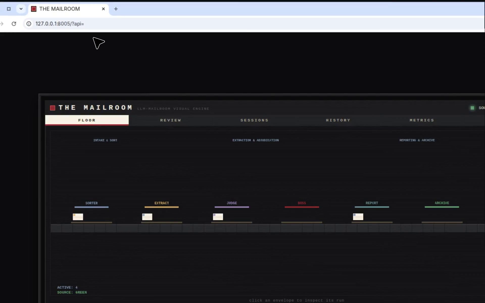

# Demos & screenshots

> Mirrored at `wiki/Demos.md`. Stills live in [`docs/screenshots/`](screenshots/);
> the walkthrough video and notebook live in [`docs/demos/`](demos/).

The pixel console, hosted Observatory, and TUI share one display API.
These captures document those desks. **Langfuse is still the sole display
source** — nothing here is canned data served to the UI.

## Walkthrough video (PR recording)

~56 seconds, 1920×1200: FLOOR → REVIEW → SESSIONS → HISTORY → METRICS →
CONSOLE → inspector, then Observatory Pipeline → Review → History →
Matters → Metrics → Debug.

[](demos/tui-server-observatory-desk-walkthrough.mp4)

- Video: [`docs/demos/tui-server-observatory-desk-walkthrough.mp4`](demos/tui-server-observatory-desk-walkthrough.mp4)
  (click the file on GitHub to play it)
- Notebook gallery: [`docs/demos/The-Mailroom-Demos.ipynb`](demos/The-Mailroom-Demos.ipynb)

## Pilot run — documents moving through the pipeline

~25 seconds, 1920×1200. A staggered FakeClient pilot (`scripts/demo_pilot_run.py`)
feeds `/api` + `/ws` so envelopes actually travel the conveyor: contract and
claim archive, the merger agreement peels to REVIEW, correspondence goes
through JUDGE/ARBITER, a corporate record fails.

[](demos/pilot-run-documents-through-pipeline.mp4)

- Video: [`docs/demos/pilot-run-documents-through-pipeline.mp4`](demos/pilot-run-documents-through-pipeline.mp4)
- Still: [`docs/screenshots/pilot-floor.png`](screenshots/pilot-floor.png)
- Re-record:

```bash
PYTHONPATH=. python scripts/demo_pilot_run.py --port 8005 --delay 8
# then open http://127.0.0.1:8005/?api=
```

## Pixel-art console (`mailroom-web`)

| Still | Desk |
|---|---|
| [floor.png](screenshots/floor.png) | FLOOR conveyor |
| [pilot-floor.png](screenshots/pilot-floor.png) | PILOT RUN — envelopes in motion |
| [inspector.png](screenshots/inspector.png) | INSPECTOR |
| [review.png](screenshots/review.png) | REVIEW siding |
| [sessions.png](screenshots/sessions.png) | SESSIONS / matters |
| [history.png](screenshots/history.png) | HISTORY + REPLAY |
| [metrics.png](screenshots/metrics.png) | METRICS |
| [console.png](screenshots/console.png) | CONSOLE |

## Hosted Observatory (`/live`)

| Still | Desk |
|---|---|
| [observatory-pipeline.png](screenshots/observatory-pipeline.png) | Pipeline trays |
| [observatory-review.png](screenshots/observatory-review.png) | Review |
| [observatory-history.png](screenshots/observatory-history.png) | History + Replay |
| [observatory-matters.png](screenshots/observatory-matters.png) | Matters |
| [observatory-metrics.png](screenshots/observatory-metrics.png) | Metrics |
| [observatory-debug.png](screenshots/observatory-debug.png) | Debug |

## TUI (`mailroom-tui`)

| Still | Desk |
|---|---|
| [tui-console.png](screenshots/tui-console.png) | Floor |
| [tui-review.png](screenshots/tui-review.png) | Review |
| [tui-sessions.png](screenshots/tui-sessions.png) | Sessions |
| [tui-metrics.png](screenshots/tui-metrics.png) | Metrics |

TUI SVGs (re-renderable): `tui-console.svg`, `tui-review.svg`,
`tui-sessions.svg`, `tui-metrics.svg` in the same folder.
`MAILROOM_API_URL=http://127.0.0.1:8001 python scripts/render_tui_shots.py`

## Seed traces into Langfuse

```bash
python scripts/seed_demo.py
python scripts/seed_demo.py --list-scenarios
python scripts/seed_demo.py --check --check-api
```

Demo envelopes are never served as a local JSON fallback. The pixel `D`
key is opt-in (`?demo=1`) and only when the source is down.
